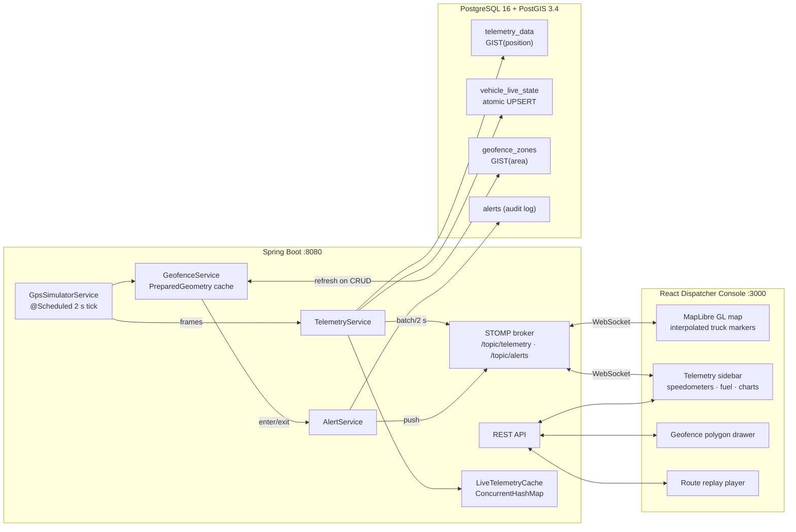
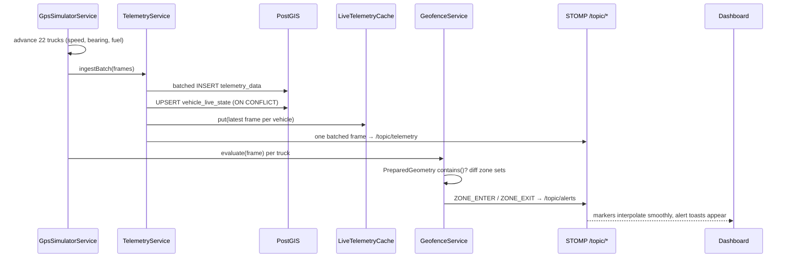

# FleetView — B2B Logistics & Fleet Telematics Platform

[](https://github.com/DilmurodElmurodov/fleetview/actions/workflows/ci.yml)


Enterprise-grade, high-load fleet telematics: **22 simulated heavy trucks** stream GPS/fuel/speed telemetry every 2 seconds over STOMP WebSockets onto a dark-mode 3D dispatcher console with live geofencing, real-time alerts, and historical route replay.

| Layer | Stack |
|---|---|
| Backend | Spring Boot 4.1 (Java 17), Spring Data JPA + Hibernate Spatial, WebSocket/STOMP, Flyway |
| Database | PostgreSQL 16 + PostGIS 3.4 (GIST spatial indexes, `ST_Contains` queries, atomic UPSERTs) |
| Frontend | React 18 + TypeScript (Vite), MapLibre GL (token-free dark basemap, 3D buildings), TailwindCSS glassmorphism, Framer Motion, Recharts, Lucide |
| Simulator | Built-in scheduled IoT emulator following real Uzbek highway corridors (M39, A373, M37, M34, A380) |

---

## 🚀 Quickstart (one command)

```bash
docker compose up -d --build
```

Then open **http://localhost:3000**. No API tokens, accounts, or manual steps — the map basemap is token-free and the simulator auto-starts.

| Service | URL |
|---|---|
| Dispatcher dashboard | http://localhost:3000 |
| Backend API | http://localhost:8086 (`BACKEND_HOST_PORT`) |
| Health | http://localhost:8086/actuator/health |
| PostGIS | localhost:5435 (`DB_HOST_PORT`), db `fleet_telematics`, user `fleet` |

### Local development

```bash
docker compose up -d postgis                # database only
SERVER_PORT=8085 ./gradlew bootRun          # backend on :8085
cd frontend && npm install && npm run dev   # dashboard on :5173
```

---

## 🏗 Architecture



### Telemetry data flow (one 2-second tick)



### Design decisions

- **Hot path never touches the DB for reads** — the dashboard's live view is served from a thread-safe `ConcurrentHashMap` cache; PostGIS remains the durable source of truth and powers history/replay.
- **Geofencing is evaluated in-process** against cached JTS `PreparedGeometry` (refreshed on every zone mutation) instead of one `ST_Contains` round-trip per truck per tick; the equivalent indexed `ST_Contains` native query exists on the repository for ad-hoc spatial queries.
- **One WebSocket message per tick**, not per truck — the whole fleet batch is a single JSON array, and the client interpolates positions at 60 fps between ticks, so markers glide instead of jumping.
- **`vehicle_live_state` uses a single-statement `INSERT … ON CONFLICT DO UPDATE`** — atomic under concurrency without row locks or retries.
- **Alerts are an append-only audit log** with per-vehicle latching (a truck speeding for 5 minutes raises one alert, not 150).

---

## 📡 API

REST base: `/api` · WebSocket endpoint: `/ws` (STOMP over native WebSocket)

Every REST response uses a uniform envelope handled by a central `@RestControllerAdvice`:

```json
{ "success": true,  "data": { }, "error": null, "timestamp": "…" }
{ "success": false, "data": null, "error": { "code": "RESOURCE_NOT_FOUND", "message": "Vehicle not found: 99", "fieldErrors": [] }, "timestamp": "…" }
```

Validation failures return `VALIDATION_FAILED` with per-field errors. WebSocket topic payloads are intentionally raw (unenveloped) streams.

| Method | Path | Description |
|---|---|---|
| GET | `/api/vehicles` | Fleet with merged live state |
| GET | `/api/vehicles/{id}` | Single vehicle |
| GET | `/api/telemetry/live` | Latest frame per vehicle (in-memory cache) |
| GET | `/api/telemetry/history/{vehicleId}?from&to&limit` | Time-ordered frames for replay (default: last hour) |
| GET | `/api/zones` | All geofence zones (polygon rings as `[[lon,lat],…]`) |
| GET | `/api/zones/containing?lon&lat` | Active zones containing a point (PostGIS `ST_Contains`, GIST-indexed) |
| POST | `/api/zones` | Create zone `{name, zoneType, coordinates}` — ring auto-closed |
| PATCH | `/api/zones/{id}/toggle` | Enable/disable a zone |
| DELETE | `/api/zones/{id}` | Delete a zone |
| GET | `/api/alerts?limit` | Recent alerts (newest first) |
| POST | `/api/alerts/{id}/ack` | Acknowledge an alert |
| GET | `/api/alerts/unacknowledged-count` | Badge counter |
| GET | `/api/simulator/status` | `{running, speedMultiplier, truckCount, tickMillis}` |
| POST | `/api/simulator/start` · `/stop` | Start / stop the fleet simulation |
| POST | `/api/simulator/speed/{1-5}` | Time-warp multiplier |
| GET | `/actuator/health` | Liveness/readiness incl. DB |

**WebSocket topics**

| Topic | Payload |
|---|---|
| `/topic/telemetry` | `TelemetrySnapshot[]` — the whole fleet, once per tick |
| `/topic/alerts` | `AlertDto` — pushed the moment a geofence/speed/fuel event fires |

**Alert types:** `ZONE_ENTER`, `ZONE_EXIT` (geofence transitions; entering a `RESTRICTED` zone is `CRITICAL` — *“Truck 01 A 102 BB breached Tashkent Border Restricted Zone!”*), `SPEEDING` (> 90 km/h), `LOW_FUEL` (< 12 %).

---

## 🗺 Dashboard guide

- **Map** — trucks glide along real highways with bearing-rotated icons (amber glow = speeding). Click a truck or a sidebar card to focus it. Zoom into a city for 3D buildings.
- **Draw geofence zone** — click the button, click vertices on the map, double-click to finish, name it, pick Restricted/Delivery/Warehouse. Trucks crossing it alert within one tick. `Esc` cancels.
- **Replay** — pick a truck in the bottom player: its recent route draws in violet and an animated marker replays it at 1×/2×/5×, with a scrubber.
- **Simulator controls** — Start/Stop the whole fleet, or time-warp physics 1×–5×.

## 🧪 Testing

```bash
./gradlew test        # requires a running Docker daemon
```

The integration suite runs against a **real PostGIS 16 instance via Testcontainers** — no mocks, no H2. Flyway migrates the throwaway database, and the tests exercise the production code paths:

| Suite | What it proves |
|---|---|
| `GeofenceEngineIntegrationTest` | Zone create/toggle/delete propagates to the prepared-geometry cache **after commit**; entering a restricted zone raises exactly one `CRITICAL` breach alert (transition latching); exit alerts fire; deactivated zones go silent; the `ST_Contains` spatial query and automatic ring-closing behave correctly; invalid geometry and missing zones are rejected |
| `TelemetryIngestionIntegrationTest` | The `ON CONFLICT` UPSERT keeps exactly one live-state row per vehicle while history appends; route history returns chronologically ordered, plate-enriched frames; **200 concurrent upserts across 8 threads** against one vehicle end with a single consistent row and zero failures |
| `B2BLogisticsApplicationTests` | Full context boot against the migrated PostGIS schema |

CI runs the suite plus a strict-TypeScript frontend build on every push and pull request.

## ⚙️ Configuration

| Env var | Default | Purpose |
|---|---|---|
| `SERVER_PORT` | `8080` | Backend HTTP port |
| `DB_HOST` / `DB_PORT` / `DB_NAME` | `localhost` / `5435` / `fleet_telematics` | Datasource |
| `DB_USER` / `DB_PASSWORD` | `fleet` / `fleet_local_dev` | Credentials (local dev defaults — override outside local) |
| `WS_ALLOWED_ORIGINS` | localhost 5173/3000/8080 | CORS + WebSocket origins |
| `fleet.simulator.*` (yml) | 2000 ms tick, 90 km/h, 12 % fuel | Simulator tuning |
| `VITE_API_URL` (frontend) | `http://localhost:8085` | Backend origin; empty ⇒ same-origin (nginx proxy) |

## 🧱 Project layout

```
├── src/main/java/org/example/b2blogistics
│   ├── domain/        # Vehicle, TelemetryData (Point), GeofenceZone (Polygon), Alert
│   ├── repository/    # Spring Data JPA + native PostGIS (ST_Contains, UPSERT)
│   ├── service/       # TelemetryService, GeofenceService, AlertService, LiveTelemetryCache
│   │   └── simulator/ # GpsSimulatorService, SimulatedTruck, RouteCatalog
│   ├── web/           # REST controllers
│   └── config/        # WebSocket/STOMP + CORS
├── src/main/resources/db/migration/   # Flyway: schema + 22-truck seed + 3 zones
├── frontend/          # React + TS dispatcher console (see frontend/src/components)
├── Dockerfile         # backend multi-stage build
├── frontend/Dockerfile+nginx.conf     # static build + /api,/ws reverse proxy
└── docker-compose.yml # postgis + backend + frontend
```

